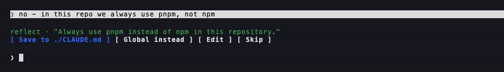

# reflect-mod

claude-reflect as a [Claude Code mod](https://claude.dev/blog/getting-started-with-claude-code-mods/): an in-process
TypeScript plugin of function hooks. Same goal as the Python plugin - turn your corrections into CLAUDE.md rules - but
the review happens above the prompt, at the moment you correct, instead of in a queue you run `/reflect` on later.



## Why a second version

On one heavy user's machine the Python plugin's queue held 102 items across 37 projects, none ever cleared; about 16
were reusable rules ([BACKLOG #1](https://github.com/BayramAnnakov/claude-reflect/blob/main/BACKLOG.md)). Regex cannot tell a rule from a one-off redirect
([BACKLOG #2](https://github.com/BayramAnnakov/claude-reflect/blob/main/BACKLOG.md)), and a queue reviewed later mostly is not reviewed. The mod changes both:

| | Python plugin | reflect-mod |
|---|---|---|
| Detection | 63 regexes at capture, model check later in `/reflect` | model check on every short prompt, any language |
| Review | `/reflect`, when you remember to run it | a band above the prompt, right away |
| Repeats | each one queued again | merged into one row with a count |
| Applies | after CLAUDE.md is re-read | in the current session at once, and in CLAUDE.md |
| Runs on | Claude Code, Codex/Cursor via AGENTS.md | Claude Code 2.1.286+ with mods |

## Install

```bash
claude plugin marketplace add bayramannakov/claude-reflect
claude plugin install reflect-mod@claude-reflect-marketplace
```

Use either this or the Python plugin, not both (every correction would be captured twice).

## How it works

1. **`prompt.submit`** - cheap checks only, so typing is never slowed: your own prompt (not one a plugin sent), not a
   slash command, not an acknowledgement ("ok", "да", "continue"), 500 characters or less, nothing that looks like a
   credential. Eligible prompts are queued; a timer does the rest outside the prompt's dispatch.
2. **The check** - one `$.model.complete` call (`haiku`) with the policy in
   the system prompt and your message plus the assistant's previous reply passed as untrusted data. It answers
   `{is_rule, rule, scope, confidence}`; anything malformed, below 0.7, multi-line, over 200 characters or
   secret-shaped is dropped.
3. **The band** - each found rule, full text, with:
   - **Save to ./CLAUDE.md** or **Save to ~/.claude/CLAUDE.md** (the scope the check suggested),
   - **Global instead** / **This repo instead**,
   - **Edit** - puts `remember: <rule>` in an empty prompt box to reword,
   - **Skip**.
4. **Save** re-reads the file just before writing and adds a bullet inside one marked section:

   ```markdown
   <!-- claude-reflect: learned rules (saved from the band; edit freely) -->
   ## Learned rules
   - Use pnpm, not npm, in this repo
   <!-- end claude-reflect -->
   ```

   A rule already in the file (as any bullet) is not added twice. Broken markers stop the write instead of guessing.
   The saved rule also goes into this session's system prompt (only while you stay in the project it belongs to).

`remember: <rule>` skips the model and goes straight to the band. `/reflect-queue` lists what was found here and
globally; `/reflect-pause` stops and resumes checking.

## Cost and privacy

One small model call per eligible prompt, on the session's own client - it counts toward your Claude usage like any
request. The prompt text is not stored; found rules are kept in the plugin's own store (a JSON file under your Claude
Code config directory) until you decide on them.

## Known limits

- Two sessions saving to the same CLAUDE.md in the same instant can lose one of the two bullets; within one session
  saves are serialized. See [BACKLOG](https://github.com/BayramAnnakov/claude-reflect/blob/main/BACKLOG.md).
- Mods are early access. A Claude Code session older than 2.1.286 that is still running writes the "mods off" flag
  into the shared `~/.claude.json`, which turns mods off for new sessions too - restart old sessions if the band never
  appears.

## Develop

```bash
claude plugin validate mod
claude plugin test mod        # 10 tests, mocked model - free
```
